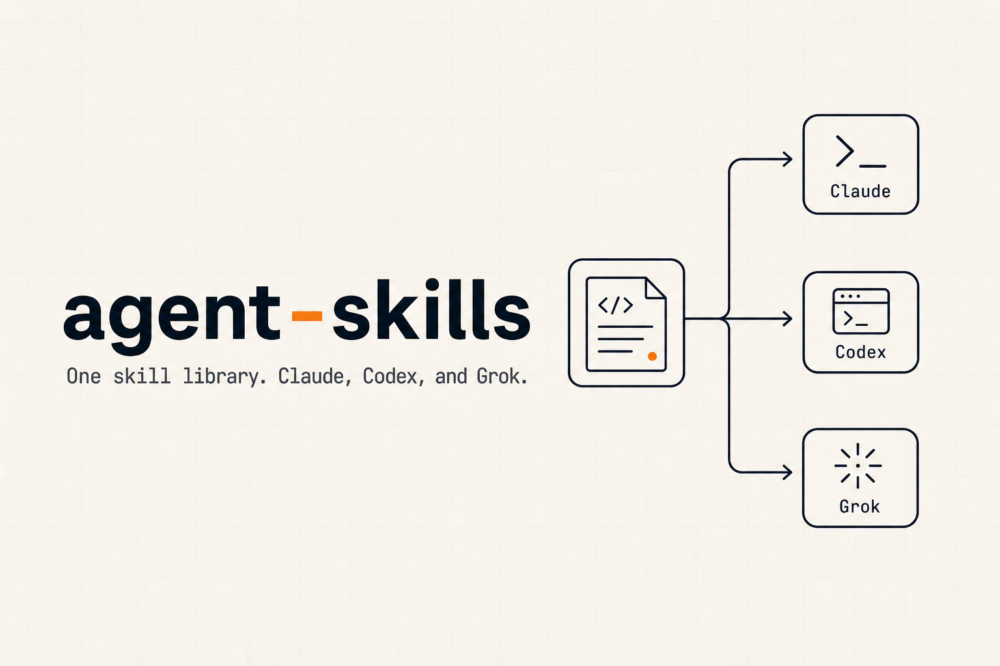

<p align="center">
  
</p>

**agent-skills** is a collection of portable skills I use across Claude Code, OpenAI Codex, and Grok Build—to mine Reddit, do keyword and SERP research, query analytics, generate media, and keep my Mac clean. Install the whole set or take one skill.

Claude Code:

```sh
claude plugin marketplace add johnkueh/agent-skills
claude plugin install agent-skills@johnkueh-agent-skills
```

Codex:

```sh
codex plugin marketplace add johnkueh/agent-skills
codex plugin add agent-skills@johnkueh-agent-skills
```

Grok Build:

```sh
grok plugin marketplace add johnkueh/agent-skills
grok plugin install agent-skills@johnkueh-agent-skills --trust
```

Want just one? Every skill is also its own plugin:

```sh
claude plugin install media-icon-search@johnkueh-agent-skills
codex plugin add marketing-reddit@johnkueh-agent-skills
grok plugin install brand-design@johnkueh-agent-skills --trust
```

## Why skills

A skill teaches an agent a job you'd otherwise re-explain every session—which API to call, which flags matter, and what the output should look like. Each harness can load the right skill from the same `SKILL.md` source.

These are the ones that earned a permanent spot in my setup. They lean on real keys and CLIs (DataForSEO, the YouTube Data API, `gcloud`, OpenAI, Gemini), so most need a token or two — each skill's `SKILL.md` says exactly what.

## The skills

### Research & SEO

| Skill | What it does |
|---|---|
| [`marketing-reddit`](skills/marketing-reddit) | Pull posts, threads, and question clusters from Reddit through a headless browser that gets past the bot challenge. |
| [`marketing-keyword-data`](skills/marketing-keyword-data) | DataForSEO keyword research — search volume, intent, difficulty, CPC, and suggestions for content planning. |
| [`marketing-serp`](skills/marketing-serp) | Geo-targeted SERP analysis — who ranks where, content gaps, and features like featured snippets and PAA. |
| [`marketing-aeo`](skills/marketing-aeo) | Track which AI chatbots (ChatGPT, Perplexity, Google AI Overview, Claude) cite a project, and how that moves. |
| [`marketing-ai-crawler`](skills/marketing-ai-crawler) | See which AI bots (GPTBot, ClaudeBot, PerplexityBot, ...) crawl your Vercel sites and which paths they hit. |
| [`marketing-youtube-transcribe`](skills/marketing-youtube-transcribe) | Get a clean transcript from any YouTube video for research, fact-checking, or content. |
| [`marketing-youtube-mine`](skills/marketing-youtube-mine) | Mine YouTube comments for unanswered questions, clustered — drop-in compatible with `marketing-reddit`'s output for SEO loops. |
| [`marketing-x`](skills/marketing-x) | Watch X profiles for new posts and get a daily digest of what they said. |

### Comms

| Skill | What it does |
|---|---|
| [`comms-slack`](skills/comms-slack) | Search Slack messages, pull a thread, or look someone up — across your channels and DMs. |
| [`comms-whatsapp`](skills/comms-whatsapp) | Read and send WhatsApp messages from the command line — search chats, list groups, grab a thread. |
| [`comms-notion`](skills/comms-notion) | Read a Notion page from its URL and return the body as markdown. |

### Build & ship

| Skill | What it does |
|---|---|
| [`dev-instantdb`](skills/dev-instantdb) | Build a working React, vanilla JS, or Expo app with InstantDB as a realtime, local-first backend. |
| [`drafty-proof-canvas`](skills/drafty-proof-canvas) | Publish proof-of-work screenshots to a drafty.im canvas so you can review and annotate visual results from any device. |

### Data

| Skill | What it does |
|---|---|
| [`data-digest`](skills/data-digest) | A per-project morning roundup — new signups, top activity, API and LLM cost, and what changed — pulled from your own data. |

### Copy & design

| Skill | What it does |
|---|---|
| [`media-icon-search`](skills/media-icon-search) | Find the right icon across Lucide, Phosphor, Tabler, Heroicons, and HugeIcons by describing it, and get the exact React import back. |
| [`media-image-gen`](skills/media-image-gen) | Generate logos, illustrations, photoreal shots, UI mockups, and ads with GPT Image 2 — with cost logged per call. |
| [`media-video-gen`](skills/media-video-gen) | Generate cinematic videos with Veo 3.1 (text/image→video) — pairs with a still, quotes exact per-second cost up front, true-loop + web MP4/WebM/poster output. |
| [`brand-design`](skills/brand-design) | A house UI/UX playbook for reviewing app and web screens — typography, spacing, dark mode, motion, the "looks AI-generated" smell test. |
| [`brand-copy`](skills/brand-copy) | A house copy guide for UI strings, errors, empty states, onboarding, and marketing — voice, tone, and microcopy. |

### Mac hygiene

| Skill | What it does |
|---|---|
| [`system-disk-cleanup`](skills/system-disk-cleanup) | Find what's eating your disk and clear it safely. |
| [`system-memory-cleanup`](skills/system-memory-cleanup) | Spot CPU and memory hogs, and clean up orphaned processes. |

## Installing one skill vs. all of them

The `agent-skills` plugin ships every skill above. Each skill is also published as its own plugin, so you can take only what you need:

```sh
claude plugin install agent-skills@johnkueh-agent-skills
claude plugin install marketing-reddit@johnkueh-agent-skills
```

Use the skill name as the plugin name—`<name>@johnkueh-agent-skills`. Bundle and single-skill installs are alternatives, not dependencies.

Once installed, the harness can load a skill automatically from its description or you can invoke it explicitly by name.

## How this repo is built

Each skill is a folder under `skills/<name>/` with a `SKILL.md` and whatever supporting files it needs. The marketplace manifest is generated, not hand-written:

```sh
pnpm build
```

This walks the committed canonical skill folders, generates Claude and Codex manifests, adds OpenAI interface metadata, and materializes real-file bundle and single-skill plugins. Real files are deliberate: installed caches remain self-contained across all three harnesses.

```sh
pnpm test
claude plugin validate --strict .
grok plugin validate plugins/agent-skills
```

Writing or changing a skill? Follow [docs/skill-conventions.md](docs/skill-conventions.md) — frontmatter triggers, line budgets, `setup`/`doctor`, secrets handling.

## License

MIT.
